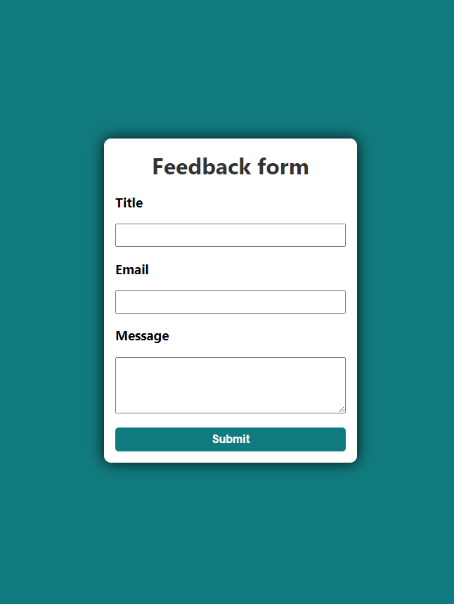

# Feedbackform

# Project – Feedbackform

This is a solution to a challenge at the DCI (Digital Career Institute). The challenges help you improve your programming skills by creating realistic projects. This task was about creating a feedback form.

## Table of contents

- [Overview](#overview)
  - [Screenshot](#screenshot)
  - [Links](#links)
- [My process](#my-process)
  - [Built with](#built-with)
  - [Frameworks](#frameworks)
  - [Tools](#tools)
  - [What I learned](#what-i-learned)
- [Author](#author)

## Overview

### Screenshot

### Links

- Solution URL: [Github Solutions](https://github.com/Adem-Tozlu/Project-Feedbackform)
- Live Site URL: [Website Feedbackform](https://project-feedbackform.vercel.app/)

## My process

### Built with

- Semantic HTML5 markup
- SASS/SCSS
- Mobile-design
- Grid
- Javascript

## Frameworks
 - React

## Tools
 - Vite
### What I have learned

I gained hands-on experience in building and manipulating React forms and learned how to effectively utilize the useState hook in this context.

## Author

- Website - [Github](https://github.com/Adem-Tozlu)
- Frontend Mentor – [@Adem-Tozlu](https://www.frontendmentor.io/profile/Adem-Tozlu)
- Linkedin - [@Adem-Tozlu](https://www.linkedin.com/in/adem-tozlu)