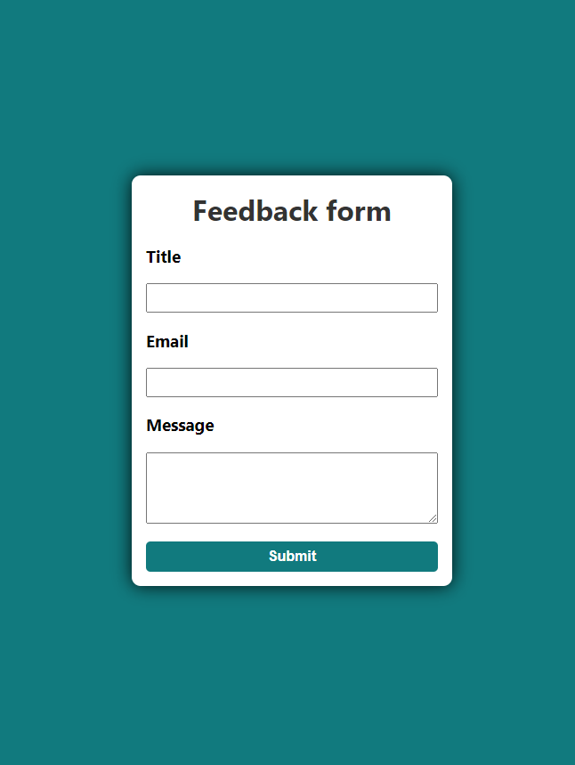

# Feedbackform

# Project – Feedbackform

Dies ist die Lösung für eine Herausforderung beim DCI (Digital Career Institute). Die Herausforderungen helfen dir dabei, deine Programmierfähigkeiten durch die Erstellung realistischer Projekte zu verbessern. Bei dieser Aufgabe ging es darum, ein Feedbackformular mit react zu erstellen.

## Table of contents

- [Übersicht](#overview)
  - [Screenshot](#screenshot)
  - [Links](#links)
- [Mein Prozess](#my-process)
  - [Erstellt mit](#built-with)
  - [Frameworks](#frameworks)
  - [Tools](#tools)
  - [Was ich gelernt habe](#what-i-learned)
- [Author](#author)

## Overview

### Screenshot

### Links

- Solution URL: [Github Solutions](https://github.com/Adem-Tozlu/Project-Feedbackform)
- Live Site URL: [Website Feedbackform](https://project-feedbackform.vercel.app/)

## My process

### Built with

- Semantic HTML5 markup
- SASS/SCSS
- Mobile-design
- Grid
- Javascript

## Frameworks
 - React

## Tools
 - Vite
### What I have learned

Während der Weiterbildung vertiefte ich meine Kenntnisse in der Erstellung und Bearbeitung von React-Formularen und lernte, wie man den useState-Hook effektiv in diesem Kontext einsetzt.

## Author

- Website - [Github](https://github.com/Adem-Tozlu)
- Frontend Mentor – [@Adem-Tozlu](https://www.frontendmentor.io/profile/Adem-Tozlu)
- Linkedin - [@Adem-Tozlu](https://www.linkedin.com/in/adem-tozlu)